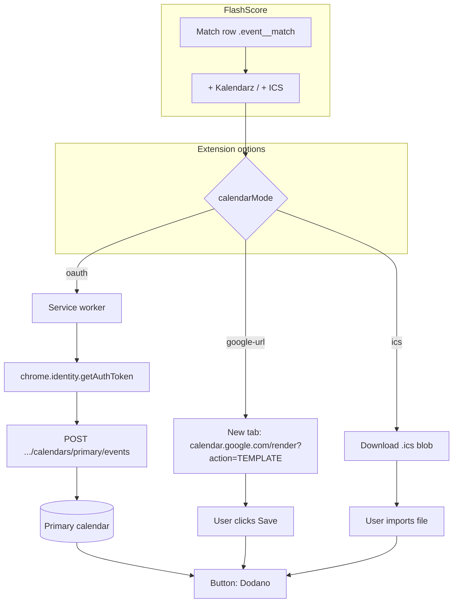
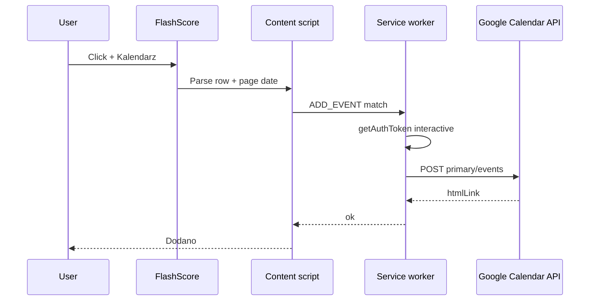
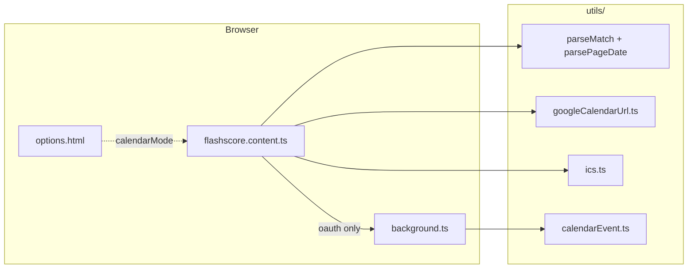

# FlashScore → Kalendarz

Chrome extension that adds a calendar button on FlashScore match rows. You choose **how** events are created — two modes work **without Google Cloud**; OAuth is optional for silent adds to your default calendar.

## Modes (latest)

Three modes are selectable in extension **Options** (`chrome.storage.sync` → `calendarMode`). Only one is active at a time.

| Mode | Key | Button label | On click | Google Cloud | Service worker |
|------|-----|--------------|----------|--------------|----------------|
| **Open Google Calendar** *(default)* | `google-url` | `+ Kalendarz` | New tab: [Calendar “create event” URL](https://calendar.google.com/calendar/render?action=TEMPLATE) with teams, league, 2 h slot — you click **Save** | Not needed | Not used |
| **Download .ics** | `ics` | `+ ICS` | Downloads `home-vs-away.ics` (import in Google / Apple / Outlook) | Not needed | Not used |
| **Add in background** | `oauth` | `+ Kalendarz` | `POST` to `calendars/primary/events` via `chrome.identity` — event on signed-in Chrome account’s **default** calendar | Required (`WXT_GOOGLE_CLIENT_ID`) | Used |

**Recent behaviour**

- **Default mode** is `google-url` — fastest way to test after `bun run dev`; no `.env`.
- **OAuth is optional at build time**: without a valid `WXT_GOOGLE_CLIENT_ID`, the manifest omits `identity` / `oauth2`; the OAuth radio is disabled in Options.
- **Same match data** in all modes: kickoff from page date + row time, summary `Home - Away`, description = league + broadcast (if TV tooltip is in DOM).
- **Repeat clicks:** the row control stays a calendar icon so you can open Google Calendar or download `.ics` again if you cancelled; **OAuth** mode only shows a brief loading state while the API runs.

Change mode: right‑click extension icon → **Options**, or `chrome://extensions` → **Details** → **Extension options**.

### Mode flow (diagram)



### End-to-end sequence (OAuth mode)



### Architecture (by layer)



## Quick start (no OAuth)

```bash
bun install
bun run dev
```

1. Load unpacked from **`dist/chrome-mv3-dev/`** (see [Load in Chrome](#load-extension-in-chrome)).
2. Options → confirm mode **Open Google Calendar** (`google-url`).
3. Open [flashscore.pl](https://www.flashscore.pl/) → scheduled match (`HH:MM`) → **+ Kalendarz**.
4. New tab with pre-filled event → **Save** in Google Calendar.

No `.env` required.

## Build flow

Build output is **`dist/`** (not a hidden `.output/` folder — visible in Finder).

| Step | Command | Output |
|------|---------|--------|
| Install deps | `bun install` | `node_modules/`, runs `wxt prepare` |
| Dev (HMR) | `bun run dev` | `dist/chrome-mv3-dev/` |
| Production | `bun run build` | `dist/chrome-mv3/` |
| Typecheck | `bun run compile` | — |
| Lint | `bun run lint` | oxlint |
| Format | `bun run format` | oxfmt |
| Zip (optional) | `bun run zip` | distributable zip |

After changing `.env` (`WXT_GOOGLE_CLIENT_ID`), **rebuild and reload** the extension so the manifest picks up OAuth.

## Load extension in Chrome

Chrome is configured locally (not remotely):

1. `bun run dev` or `bun run build`.
2. `chrome://extensions` → **Developer mode** → **Load unpacked**.
3. Select:
   - Dev: `dist/chrome-mv3-dev/`
   - Prod: `dist/chrome-mv3/`
4. Copy **Extension ID** (only for OAuth / Google Cloud).

Reload (↻) after rebuilds; `bun run dev` can auto-reload during development.

## OAuth mode (optional)

For one-click add without a new tab or `.ics` file.

### 1. Environment

```bash
cp .env.example .env
```

```env
WXT_GOOGLE_CLIENT_ID=123456789-xxxx.apps.googleusercontent.com
```

```bash
bun run build
# Reload extension in chrome://extensions
```

### 2. Google Cloud (one-time)

1. [Google Cloud Console](https://console.cloud.google.com/) → project.
2. Enable **Google Calendar API**.
3. **OAuth consent screen** (External + test user is fine for personal use).
4. **Credentials** → **OAuth client ID** → **Chrome extension**.
5. **Application ID** = extension ID from `chrome://extensions` (exact match).
6. Client ID → `.env` → rebuild → reload.

### 3. Options

Select **Dodaj w tle (OAuth)**. First match click triggers consent; events use the Chrome profile’s **primary** calendar.

## Project layout

```
entrypoints/
  background.ts           # OAuth + Calendar API (oauth mode only)
  flashscore.content.ts   # DOM, buttons, ics + google-url handlers
  options.html            # Mode picker UI
  options/main.ts
utils/
  calendarEvent.ts        # Shared event fields (all modes)
  googleCalendarUrl.ts    # google-url mode
  ics.ts                  # ics mode
  mode.ts                 # calendarMode storage
  config.ts               # is OAuth configured at build time?
wxt.config.ts             # outDir: dist, conditional oauth2 manifest
```

## Troubleshooting

| Problem | Fix |
|---------|-----|
| No button on row | Row needs scheduled kickoff `HH:MM` (not live-only). |
| OAuth option greyed out | Set valid `WXT_GOOGLE_CLIENT_ID`, `bun run build`, reload extension. |
| `Invalid OAuth client` | Google Cloud extension ID ≠ loaded extension ID. |
| Google URL empty dates | Reselect day on FlashScore so page date parses. |
| `.ics` does not auto-import | Import manually (Calendar → Import / open file). |
| Cannot find build folder | Use `dist/chrome-mv3/` or `dist/chrome-mv3-dev/` (not `.output`). |

## Scripts

```bash
bun run dev          # development → dist/chrome-mv3-dev/
bun run build        # production → dist/chrome-mv3/
bun run zip          # production zip → dist/*-chrome.zip
bun run compile      # TypeScript
bun run lint         # oxlint
bun run format       # oxfmt
bun run website:dev   # marketing site (Vite) → http://localhost:5173/flashscore-calendar/
bun run website:build # production build of the site → website/dist/
```

## Documentation site (GitHub Pages)

The install / configuration guide is published as a static site (Vite + React + Tailwind, shadcn-style UI):

**https://benedyktdryl.github.io/flashscore-calendar/**

Enable it once (before the first deploy can succeed): **Repository → Settings → Pages → Build and deployment → Source: GitHub Actions**.  
If that is still set to “Deploy from a branch” or Pages is off, the deploy job cannot attach to a Pages site.

Pushes to `main` run [`.github/workflows/pages.yml`](.github/workflows/pages.yml) and deploy `website/dist`.

Local preview:

```bash
bun run website:dev
# open http://localhost:5173/flashscore-calendar/
```

For a fork, set `VITE_SITE_URL` and `VITE_BASE_PATH` in [`website/.env.production`](website/.env.production) to match `https://<user>.github.io/<repo>/`.
